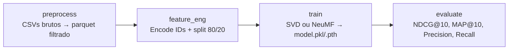

# E-Commerce Recommendation System


Sistema de recomendação de produtos para e-commerce baseado no histórico de compras do usuário, implementado com redes neurais do tipo embedding-based (**NeuMF**). Dataset: **Instacart Market Basket Analysis**.

---

## Objetivo

Dado o histórico de compras de um usuário, ranquear produtos com maior probabilidade de serem comprados novamente, aumentando a taxa de conversão e a relevância das recomendações.

---

## Stack Tecnológica

| Camada                       | Tecnologia            |
| ---------------------------- | --------------------- |
| Modelagem                    | PyTorch, Scikit-Learn |
| Rastreamento de experimentos | MLflow                |
| Versionamento de dados       | DVC                   |
| Empacotamento                | Docker                |
| Dependências                | Poetry / uv           |
| Linguagem                    | Python 3.11+          |

---

## Resultados

O modelo **NeuMF** (Neural Matrix Factorization) foi treinado por 20 épocas e superou o baseline SVD em **mais de 3×** em NDCG@10:

| Modelo                             |     NDCG@10     |     MAP@10     |  Precision@10  |    Recall@10    |
| :--------------------------------- | :-------------: | :-------------: | :-------------: | :-------------: |
| **NeuMF Final (20 épocas)** | **7.10%** | **2.97%** | **5.63%** | **5.24%** |
| Baseline SVD                       |      2.17%      |      0.73%      |      2.02%      |      2.59%      |

> Para detalhes completos sobre a arquitetura, limitações e vieses, veja o [Model Card](docs/model_card.md).

---

## Pré-requisitos

- Python 3.11+
- [Poetry](https://python-poetry.org/docs/#installation) **ou** [uv](https://docs.astral.sh/uv/)
- [Docker Desktop](https://www.docker.com/products/docker-desktop/) (para execução via container)
- Conta no [Kaggle](https://www.kaggle.com) (para baixar o dataset)

---

## Setup do Ambiente

### 1. Clonar o repositório

```bash
git clone <url-do-repositorio>
cd ecommerce-recommendation-system
```

### 2. Instalar dependências

Com **Poetry**:

```bash
poetry install
```

Com **uv** (alternativa mais rápida):

```bash
uv sync
```

### 3. Configurar variáveis de ambiente

```bash
cp .env.example .env
```

Edite o `.env` se necessário (os valores padrão funcionam para desenvolvimento local).

### 4. Validar o ambiente

```bash
# Com Poetry
poetry run python scripts/validate_env.py

# Com uv
uv run python scripts/validate_env.py
```

---

## Dataset

O projeto usa o **Instacart Market Basket Analysis** (~3M pedidos, ~200K usuários, ~50K produtos).

### Download

1. Acesse: [kaggle.com/competitions/instacart-market-basket-analysis/data](https://www.kaggle.com/datasets/psparks/instacart-market-basket-analysis?resource=download)
2. Baixe e extraia o arquivo zip
3. Copie **apenas** os dois arquivos necessários:

```
data/
└── raw/
    ├── orders.csv                   (~104 MB)
    └── order_products__prior.csv    (~552 MB)
```

> Os demais arquivos do Kaggle (`products.csv`, `aisles.csv`, etc.) não são utilizados.

---

## Pipeline DVC

O pipeline é orquestrado pelo DVC e executa 4 etapas em sequência:



### Rodar o pipeline completo

```bash
# Com Poetry
poetry run dvc repro

# Com uv
uv run dvc repro
```

O DVC detecta automaticamente o que mudou e só re-executa as etapas necessárias.

### Ver as métricas

```bash
poetry run dvc metrics show
# ou
uv run dvc metrics show
```

### Detalhes das etapas

| Etapa           | Script                             | Entrada                          | Saída                                |
| --------------- | ---------------------------------- | -------------------------------- | ------------------------------------- |
| `preprocess`  | `recsys/pipeline/preprocess.py`  | `data/raw/`                    | `data/interim/preprocessed.parquet` |
| `feature_eng` | `recsys/pipeline/feature_eng.py` | `preprocessed.parquet`         | `train.parquet`, `test.parquet`   |
| `train`       | `recsys/pipeline/train.py`       | `train.parquet`                | `models/model.pkl`                  |
| `evaluate`    | `recsys/pipeline/evaluate.py`    | `model.pkl` + `test.parquet` | `metrics.json`                      |

### Alternar entre modelos

O modo de treino é controlado em [`params.yaml`](params.yaml):

```yaml
model:
  recommender_type: neural   # "baseline" para SVD, "neural" para NeuMF
  embedding_dim: 8
  epochs: 20
  batch_size: 1024
  lr: 0.01
  dropout: 0.2
  patience: 3
```

---

## Docker

O projeto tem um `Dockerfile` multi-stage (builder → runtime → pipeline) e um `docker-compose.yml` com 3 serviços.

> **Pré-requisito:** os dados já devem estar em `data/processed/` (rode `dvc repro` antes, ou `dvc pull`).

### 1. Subir o MLflow Server

```bash
docker compose up mlflow -d
```

Acesse a UI em `http://localhost:5001`.

### 2. Rodar o treino via container

```bash
docker compose run --rm train
```

### 3. Rodar o pipeline completo com DVC dentro do container

```bash
docker compose run --rm pipeline
```

### 4. Derrubar os serviços

```bash
docker compose down
```

---

## MLflow

O MLflow rastreia experimentos, loga métricas e registra modelos no Model Registry.

### Subir o servidor local

```bash
docker compose up mlflow -d
```

Acesse `http://localhost:5001` para ver experimentos, comparar runs e gerenciar modelos.

### Registrar e promover o modelo para Production

Após executar o pipeline, rode o script de registro:

```bash
# Garante que o servidor MLflow está rodando primeiro
docker compose up mlflow -d

# Registra e promove o NeuMF para Production
uv run python scripts/register_model.py
# ou
poetry run python scripts/register_model.py
```

O script automaticamente:

1. Encapsula o modelo em um wrapper `mlflow.pyfunc.PythonModel`
2. Registra sob o nome `NeuMF-Instacart` no Model Registry
3. Promove a última versão para o estágio **Production**

### Verificar o modelo em Production

```bash
uv run python -c "
import mlflow
mlflow.set_tracking_uri('http://localhost:5001')
from mlflow.tracking import MlflowClient
client = MlflowClient()
print([(mv.name, mv.version, mv.current_stage)
       for mv in client.get_latest_versions('NeuMF-Instacart')])
"
```

---

## Comandos Úteis

```bash
# Rodar testes
poetry run pytest
# ou
uv run pytest

# Lint
poetry run ruff check src tests
uv run ruff check src tests

# Validar ambiente
poetry run python scripts/validate_env.py

# Testar uma recomendação manualmente
uv run python -c "
import pickle
model = pickle.load(open('models/model.pkl', 'rb'))
print(model.recommend(user_id=1, top_k=5))
"

# Ver métricas do pipeline
poetry run dvc metrics show

# Verificar status do pipeline DVC
poetry run dvc status
```

Com `make` (Linux/macOS):

```bash
make install     # instala dependências
make test        # roda testes
make lint        # roda o linter
make pipeline    # executa dvc repro
make metrics     # exibe métricas
make help        # lista todos os comandos
```

---

## Estrutura do Repositório

```
ecommerce-recommendation-system/
├── Dockerfile                      # Multi-stage: builder → runtime → pipeline
├── docker-compose.yml              # Serviços: mlflow, train, pipeline
├── Makefile                        # Atalhos para tarefas comuns
├── dvc.yaml                        # Pipeline DVC (4 etapas)
├── dvc.lock                        # Hashes dos artefatos (gerado por dvc repro)
├── params.yaml                     # Hiperparâmetros do pipeline (lido pelo DVC)
├── metrics.json                    # Métricas do último evaluate
├── pyproject.toml                  # Dependências e configuração
├── ruff.toml                       # Configuração do linter
├── .env.example                    # Variáveis de ambiente (copie para .env)
├── docs/
│   ├── model_card.md               # Model Card: arquitetura, performance e vieses
│   ├── decisions.md                # ADRs: decisões arquiteturais (ADR-001 a ADR-011)
│   ├── kickoff.md                  # Definição do problema e divisão de responsabilidades
│   └── reports/                    # Walkthroughs de execução e logging
├── data/
│   ├── raw/                        # CSVs do Instacart (gerenciados pelo DVC)
│   ├── interim/                    # Dados pré-processados
│   └── processed/                  # Features prontas para treino
├── models/                         # Modelos serializados (.pkl / .pth)
├── scripts/
│   ├── register_model.py           # Registra e promove o modelo no MLflow
│   └── validate_env.py             # Valida o ambiente de desenvolvimento
├── src/recsys/
│   ├── config/settings.py          # Configuração central (Pydantic Settings)
│   ├── data/
│   │   ├── loader.py               # Interface abstrata BaseInteractionLoader
│   │   └── instacart_loader.py     # Carregador concreto do Instacart
│   ├── models/
│   │   └── neural_net.py           # Arquitetura NeuMF (PyTorch nn.Module)
│   ├── pipeline/
│   │   ├── preprocess.py           # Etapa 1: limpeza + k-core filtering
│   │   ├── feature_eng.py          # Etapa 2: encode IDs + split treino/teste
│   │   ├── train.py                # Etapa 3: treino (SVD ou NeuMF) + MLflow logging
│   │   └── evaluate.py             # Etapa 4: métricas + MLflow logging
│   ├── recommenders/
│   │   ├── base.py                 # Interface Strategy BaseRecommender
│   │   ├── baseline.py             # SVDRecommender (scikit-learn TruncatedSVD)
│   │   ├── popularity.py           # PopularityRecommender (baseline)
│   │   └── neural.py               # NeuralRecommender (NeuMF em PyTorch)
│   ├── metrics/
│   │   └── evaluation.py           # Precision@K, Recall@K, NDCG@K, MAP@K
│   └── utils/seeds.py              # Fixação de seeds globais
├── tests/
│   ├── test_data_pipeline.py       # Testes do loader e funções de pipeline
│   ├── test_recommenders.py        # Testes dos recomendadores (Popularity, SVD)
│   ├── test_neural_recommender.py  # Testes do NeuralRecommender e SVD em lote
│   └── test_settings.py            # Testes de configuração e seeds
└── configs/default.yaml            # Parâmetros padrão do projeto
```

---

## Convenções de Desenvolvimento

### Branches

```
main                              → código estável/entregável
develop                           → integração contínua da equipe
feature/<escopo>/<descricao>      → ex: feature/data/instacart-loader
fix/<descricao>                   → ex: fix/embedding-shape
docs/<descricao>                  → ex: docs/model-card
model/<descricao>                 → ex: model/neumf-architecture
```

### Commits Semânticos

```
feat:      nova funcionalidade
fix:       correção de bug
docs:      documentação
data:      pipeline ou transformação de dados
model:     arquitetura, treino ou avaliação
refactor:  refatoração sem mudança de comportamento
test:      testes
chore:     build, dependências, configuração
```

---

## Referências

- He, X. et al. (2017). *Neural Collaborative Filtering*. WWW '17. [arXiv:1708.05031](https://arxiv.org/abs/1708.05031)
- Instacart. *Instacart Market Basket Analysis*. Kaggle, 2017.
