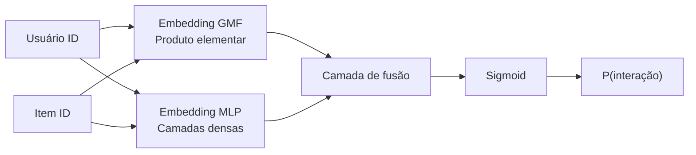
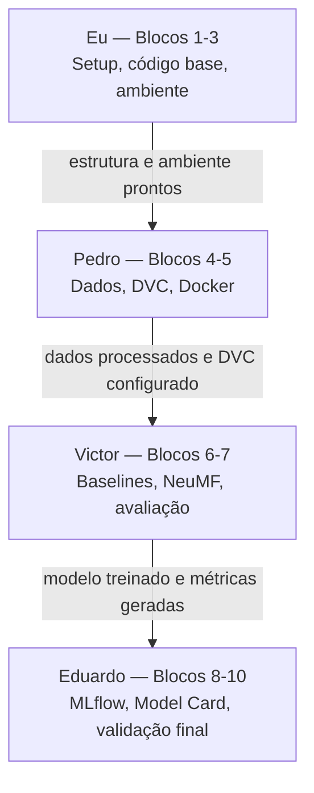

# Kickoff — E-Commerce Recommendation System

> **Fase:** Definição do Problema e Planejamento Inicial  
> **Data:** Junho de 2026  
> **Status:** Kickoff consolidado — decisões confirmadas pela equipe

---

## 1. Contexto do Projeto

E-commerces sofrem com baixa taxa de conversão e alto índice de abandono de sessão quando os produtos exibidos não são relevantes para o perfil do visitante. Sistemas de recomendação personalizados são uma das alavancas de maior impacto em receita neste segmento — responsáveis por 35% das receitas da Amazon e por reduções significativas no custo de aquisição de clientes em plataformas como Netflix e Spotify.

Este projeto constrói um sistema de recomendação de produtos baseado em histórico de interações usuário-item, utilizando redes neurais e boas práticas de engenharia de machine learning.

---

## 2. Definição do Problema de Negócio

**Problema:**  
Um e-commerce genérico não apresenta produtos relevantes ao usuário no momento certo, resultando em baixa taxa de clique (CTR) e baixa conversão.

**Solução proposta:**  
Dado o histórico de interações de um usuário (avaliações, compras, cliques), o sistema deve ranquear os produtos com maior probabilidade de engajamento para cada usuário, de forma personalizada e em tempo de inferência aceitável.

**Variável alvo:**  
Feedback implícito binário derivado de ratings explícitos:
- Interação positiva: rating ≥ 4 → label `1` *(threshold proposto; a ser validado após EDA — ver ADR-003)*
- Interação negativa: amostrada por negative sampling (item não visto pelo usuário) → label `0`

**Estratégia de treinamento:**  
Pointwise com Binary Cross-Entropy Loss. Opcionalmente, Bayesian Personalized Ranking (BPR) como alternativa pairwise a ser avaliada na fase de modelagem.

---

## 3. Objetivo do Sistema de Recomendação

| Dimensão | Descrição |
|---|---|
| **Objetivo primário** | Ranquear os top-K produtos mais relevantes para cada usuário |
| **Métrica principal** | NDCG@10 (Normalized Discounted Cumulative Gain) |
| **Métrica secundária** | HR@10 (Hit Rate@10) |
| **Baseline** | Popularidade global dos itens (most popular items) |
| **Critério de sucesso mínimo** | NDCG@10 > baseline de popularidade |

### 3.1 Análise Comparativa: HR@10 vs NDCG@10

| Critério | HR@10 | NDCG@10 |
|---|---|---|
| **O que mede** | Se pelo menos 1 item relevante aparece no top-10 | Qualidade do ranqueamento, penalizando itens relevantes em posições inferiores |
| **Sensibilidade à posição** | Não — posição 1 = posição 10 | Sim — posição 1 vale mais do que posição 10 |
| **Fórmula** | `hits / usuarios` | `DCG@10 / IDCG@10` |
| **Facilidade de interpretação** | Alta — percentual intuitivo | Média — requer explicação do desconto por posição |
| **Discriminação entre modelos** | Menor — pode plateauar cedo | Maior — diferencia modelos com ranking similar |
| **Uso na literatura** | Amplamente reportado | Métrica primária em He et al. (2017) — NeuMF original |
| **Risco de inflação por baseline popular** | Alto | Menor — popular ≠ bem ranqueado |

**Decisão: NDCG@10 como métrica principal de apresentação.**

Justificativa técnica:

1. **Alinhamento com o paper de referência:** He et al. (2017) usa NDCG@10 como métrica primária. A escolha permite comparação direta com os resultados publicados.
2. **Posição importa no e-commerce:** Um produto na posição 1 recebe exponencialmente mais cliques do que na posição 10. NDCG@10 captura essa diferença; HR@10 não.
3. **Maior poder discriminativo:** Em cenários onde dois modelos têm HR@10 similar, o NDCG@10 ainda diferencia aquele que rankeia melhor os itens relevantes.
4. **Resistência ao baseline trivial:** Um modelo de popularidade pode ter HR@10 razoável; NDCG@10 é mais difícil de inflar, tornando a comparação com o NeuMF mais honesta.
5. **Ambas serão reportadas:** HR@10 serve como complemento narrativo para audiência não-técnica; NDCG@10 é o número titular da apresentação.

---

## 4. Comparação de Datasets Públicos

### 4.1 Amazon Reviews 2023 — "Toys and Games"

| Atributo | Detalhe |
|---|---|
| **Domínio** | E-commerce (brinquedos e jogos) |
| **Tipo de interação** | Ratings explícitos (1–5 estrelas) + metadados de produto |
| **Volume aproximado** | ~165 K avaliações / ~19 K usuários / ~11 K produtos |
| **Disponibilidade** | HuggingFace Datasets ou download direto (sem autenticação) |
| **Licença** | Uso acadêmico permitido (McAuley Lab, UCSD) |

**Vantagens:**
- Domínio e-commerce real — alinhamento direto com o problema de negócio
- Metadados ricos: categoria, preço, descrição textual (útil para feature engineering futuro)
- Volume dentro da faixa ideal para treino local sem GPU cluster
- Referência acadêmica consolidada e amplamente citada
- Conversível para feedback implícito com threshold de rating

**Desvantagens:**
- Esparsidade alta (~99% da matriz user-item não preenchida)
- Requer limpeza para remover usuários/itens com poucas interações (filtro de k-core)

**Adequação ao desafio:** ⭐⭐⭐⭐⭐

---

### 4.2 MovieLens 1M

| Atributo | Detalhe |
|---|---|
| **Domínio** | Entretenimento (filmes) |
| **Tipo de interação** | Ratings explícitos (1–5 estrelas) |
| **Volume aproximado** | 1 M ratings / ~6 K usuários / ~4 K filmes |
| **Disponibilidade** | GroupLens Research (download direto) |
| **Licença** | Uso acadêmico e não-comercial |

**Vantagens:**
- Dataset extremamente limpo, sem necessidade de pré-processamento intenso
- Benchmark universal — facilidade de comparação com literatura
- Volume suficiente e baixa esparsidade relativa
- Fácil de usar com bibliotecas como Surprise e PyTorch

**Desvantagens:**
- Domínio de filmes, não e-commerce — distância semântica do problema de negócio
- Menos convincente para uma apresentação focada em e-commerce

**Adequação ao desafio:** ⭐⭐⭐⭐

---

### 4.3 H&M Personalized Fashion (Kaggle)

| Atributo | Detalhe |
|---|---|
| **Domínio** | E-commerce de moda |
| **Tipo de interação** | Implícito (histórico de transações/compras) |
| **Volume aproximado** | ~31 M transações / ~1.4 M clientes / ~105 K produtos |
| **Disponibilidade** | Kaggle Competition (requer aceite de termos) |
| **Licença** | Restrita — uso apenas para a competição original |

**Vantagens:**
- Volume massivo e feedback implícito real de e-commerce
- Domínio de moda com diversidade de categorias
- Dados de item ricos (imagens, descrição textual, tipo de produto)

**Desvantagens:**
- Tamanho requer infraestrutura maior (memória, armazenamento, tempo de treino)
- Licença restritiva da competição Kaggle limita uso acadêmico genérico
- Complexidade de pré-processamento elevada para equipes menores

**Adequação ao desafio:** ⭐⭐⭐

---

## 5. Dataset Escolhido e Justificativa

### Dataset selecionado: Amazon Reviews 2023 — "Toys and Games"

**Justificativa técnica:**

1. **Alinhamento de domínio:** E-commerce real. Avaliações de produtos com contexto direto de compra e uso — narrativa de negócio coesa para a apresentação final.

2. **Volume adequado:** ~165 K avaliações superam o requisito mínimo de 10.000 interações por margem confortável (16×), sem exigir infraestrutura de grande escala.

3. **Conversibilidade para feedback implícito:** Ratings explícitos com threshold ≥ 4 são um padrão bem estabelecido para geração de sinal binário implícito, alinhado à estratégia de treinamento do NeuMF.

4. **Reprodutibilidade:** Disponível sem autenticação via HuggingFace (`McAuley-Lab/Amazon-Reviews-2023`), permitindo reprodução completa do pipeline com um único comando.

5. **Referência acadêmica:** Citado extensamente na literatura de sistemas de recomendação, conferindo credibilidade ao trabalho.

6. **Escalabilidade progressiva:** O mesmo código funcionará com subconjuntos maiores (Electronics, Books) em etapas futuras sem refatoração.

**Validação do requisito de volume mínimo:**

| Requisito | Valor mínimo | Dataset escolhido | Status |
|---|---|---|---|
| Interações user-item | 10.000 | ~165.000 | ✅ Aprovado |

---

## 6. Abordagem do Modelo

### 6.1 Opções avaliadas

| Abordagem | Descrição |
|---|---|
| **MLP puro** | Concatenação de features de usuário e item → camadas densas → saída sigmoid |
| **NeuMF (Neural Matrix Factorization)** | Embeddings de usuário e item → dois ramos paralelos (GMF + MLP) → camada de fusão → saída sigmoid |

### 6.2 Decisão: NeuMF (Neural Collaborative Filtering)

**Referência:** He, X., Liao, L., Zhang, H., Nie, L., Hu, X., & Chua, T. S. (2017). *Neural Collaborative Filtering*. WWW '17.

**Arquitetura resumida:**



**Justificativa técnica:**

1. **Atende ambos os requisitos:** A arquitetura combina MLP e embeddings — satisfaz literalmente a restrição do desafio ("MLP ou embedding-based").

2. **Expressividade superior ao MLP puro:** O ramo GMF captura interações lineares (semelhante ao Matrix Factorization clássico), enquanto o MLP captura padrões não-lineares. A fusão dos dois supera qualquer ramo isolado.

3. **Benchmark consolidado:** NeuMF é o modelo de referência para collaborative filtering neural, com métricas publicadas no mesmo dataset Amazon Reviews — comparação direta possível.

4. **Complexidade implementável:** A arquitetura completa cabe em ~150 linhas de PyTorch puro, adequada ao escopo do Tech Challenge.

5. **Extensível:** A mesma estrutura suporta adição de features de item (side information) em etapas futuras sem redesign da arquitetura.

---

## 7. Divisão de Responsabilidades

A equipe é composta por 4 integrantes. A divisão segue os blocos do [plano cronológico do Tech Challenge](../tech-challenge-ordenacao.md).

| Integrante | Blocos do plano | Responsabilidades principais | Entregáveis |
|---|---|---|---|
| **Eu** | Blocos 1, 2 e 3 | Definição do problema, setup do repositório, estrutura de código, `pyproject.toml`, `ruff`, `pre-commit`, variáveis de ambiente | `docs/kickoff.md`, `docs/decisions.md`, `pyproject.toml`, `.gitignore`, `src/` scaffolding, `scripts/validate_env.py` |
| **Pedro** | Blocos 4 e 5 | Download e EDA do dataset, preprocessamento, feature engineering, DVC, `Dockerfile`, `docker-compose.yml` | `data/`, notebooks de EDA, `dvc.yaml`, `Dockerfile`, `docker-compose.yml` |
| **Victor** | Blocos 6 e 7 | Implementação de baselines com Scikit-Learn, NeuMF em PyTorch, loop de treino, avaliação NDCG@10/HR@10, tuning | `src/models/`, `src/evaluation/`, notebooks de experimento |
| **Eduardo** | Blocos 8, 9 e 10 | MLflow tracking, Model Registry, Model Card, README final, lint/testes finais, validação do pipeline completo | `experiments/`, `docs/model_card.md`, README final, relatório de validação |

### 7.1 Dependências críticas entre integrantes



> **Risco de sequenciamento:** Blocos têm dependências lineares. Atrasos em blocos 1–3 propagam para toda a cadeia. A revisão do threshold de rating (bloco 4) é pré-requisito para o treino do modelo (bloco 7).

---

## 8. Convenções de Branch, PR e Commits

### 8.1 Estratégia de Branches (Git Flow simplificado)

```
main        → código estável e entregável (protegido)
develop     → branch de integração da equipe
```

Branches de trabalho derivam de `develop`:

```
feature/<escopo>/<descricao>    ex: feature/data/amazon-loader
model/<descricao>               ex: model/neumf-architecture
fix/<descricao>                 ex: fix/embedding-shape
docs/<descricao>                ex: docs/kickoff-inicial
chore/<descricao>               ex: chore/setup-mlflow
```

### 8.2 Pull Requests

- Todo trabalho chega a `develop` via PR — commit direto proibido
- Merge em `main` apenas via PR com aprovação coletiva
- Mínimo 1 revisor por PR
- Título do PR segue o padrão de commits semânticos
- PR deve descrever: o que muda, como testar, checklist de qualidade marcado

### 8.3 Commits Semânticos (Conventional Commits)

```
feat:      nova funcionalidade
fix:       correção de bug
docs:      criação ou atualização de documentação
data:      scripts ou transformações de dados
model:     arquitetura, treino, avaliação ou tuning
refactor:  refatoração sem mudança de comportamento
test:      adição ou correção de testes
chore:     build, dependências, configuração de ambiente
```

**Exemplos:**
```
feat: adicionar loader do dataset Amazon Reviews
data: aplicar filtro 5-core na matriz user-item
model: implementar ramo GMF do NeuMF
docs: adicionar decisões arquiteturais ao decisions.md
chore: configurar MLflow com SQLite backend
```
