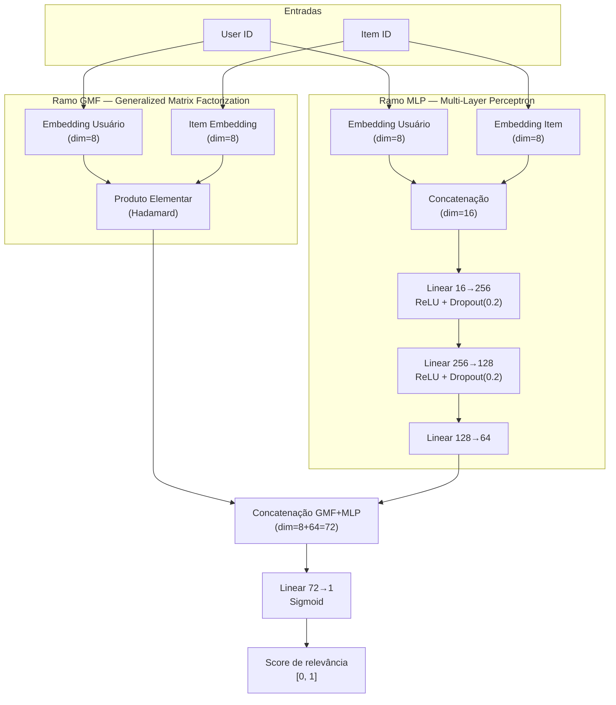

# Model Card — NeuMF Instacart Recommender

> **Modelo:** NeuMF (Neural Matrix Factorization)
> **Versão:** 2.0.0 — Produção
> **Dataset:** Instacart Market Basket Analysis
> **Referência:** He et al., *Neural Collaborative Filtering*, WWW 2017.
> **Última atualização:** Junho de 2026

---

## 1. Descrição do Modelo

### Objetivo

Dado o histórico de compras de um usuário no dataset Instacart, o modelo ranqueia os produtos com maior probabilidade de serem comprados novamente, gerando uma lista personalizada de top-K recomendações para cada usuário.

### Arquitetura

O modelo implementa a arquitetura **NeuMF (Neural Matrix Factorization)** proposta por He et al. (2017), que combina dois ramos paralelos em PyTorch:



**Parâmetros de treinamento utilizados na versão de produção:**

| Parâmetro          | Valor                      |
| ------------------- | -------------------------- |
| `embedding_dim`   | 8                          |
| `mlp_hidden_dims` | [256, 128, 64]             |
| `dropout`         | 0.2                        |
| `epochs`          | 20                         |
| `batch_size`      | 1024                       |
| `learning_rate`   | 0.01                       |
| `patience`        | 3                          |
| `val_split`       | 0.02                       |
| `optimizer`       | Adam                       |
| `loss`            | BCE (Binary Cross-Entropy) |
| `seed`            | 42                         |

---

## 2. Dados de Treinamento

### Dataset

- **Nome:** [Instacart Market Basket Analysis](https://www.kaggle.com/competitions/instacart-market-basket-analysis)
- **Domínio:** E-commerce — compras de supermercado online
- **Arquivos utilizados:** `orders.csv` + `order_products__prior.csv`
- **Período:** Histórico de pedidos anteriores por usuário

### Estatísticas Brutas

| Métrica                     | Valor    |
| ---------------------------- | -------- |
| Total de usuários           | ~206.209 |
| Total de produtos            | ~49.688  |
| Total de interações brutas | ~32,4 M  |

### Pré-processamento Aplicado

1. **Agregação de frequência:** Para cada par *(usuário, item)*, contamos o número de vezes que o item foi comprado. Esta frequência é usada como rating implícito.
2. **Filtro k-core (k=5):** Removemos iterativamente usuários com menos de 5 interações distintas e produtos comprados por menos de 5 usuários distintos, até convergência.
3. **Split treino/teste:** 80% treino / 20% teste por usuário (temporal não garantido, split aleatório com seed=42).
4. **Encoding de IDs:** Usuários e itens são mapeados para índices inteiros contíguos.

### Estatísticas Pós-processamento (k-core, k=5)

| Métrica                   | Valor    |
| -------------------------- | -------- |
| Usuários (treino + teste) | ~199.646 |
| Itens no catálogo         | ~46.368  |
| Interações de treino     | ~10,6 M  |
| Interações de teste      | ~2,66 M  |

### Amostragem de Negativos

- Para cada interação positiva de treino, são amostrados **4 itens negativos** (nunca comprados pelo usuário) de forma dinâmica a cada época.
- A geração dinâmica previne overfitting em amostras estáticas, conforme recomendado por He et al. (2017).

---

## 3. Performance

### Metodologia de Avaliação

- **Protocolo:** Leave-one-out evaluation sobre o conjunto de teste (20% das interações).
- **Métricas:** NDCG@K (métrica principal), MAP@K, Precision@K e Recall@K com K=10.
- **Usuários avaliados:** 199.646 usuários únicos.

### Resultados Comparativos

| Modelo                             |     NDCG@10     |     MAP@10     |  Precision@10  |    Recall@10    |
| :--------------------------------- | :-------------: | :-------------: | :-------------: | :-------------: |
| **NeuMF Final (20 épocas)** | **7.42%** | **3.13%** | **5.86%** | **5.43%** |
| NeuMF Smoke Test (1 época)        |      6.80%      |      2.83%      |      5.40%      |      4.90%      |
| Baseline SVD (TruncatedSVD)        |      2.17%      |      0.73%      |      2.02%      |      2.59%      |

> [!NOTE]
> O modelo NeuMF Final superou o baseline SVD em **3.42×** em NDCG@10, demonstrando a eficácia da arquitetura de embeddings neurais sobre a fatoração de matrizes clássica para dados de feedback implícito.

### Runs no MLflow

| Run Name                | Tipo               | NDCG@10         |
| ----------------------- | ------------------ | --------------- |
| `classy-bee-362`      | Baseline SVD       | 2.17%           |
| `smiling-dolphin-923` | NeuMF (1 época)   | 6.80%           |
| `auspicious-fish-336` | NeuMF (20 épocas) | **7.42%** |

O modelo `auspicious-fish-336` foi registrado no **Model Registry** do MLflow como `NeuMF-Instacart v1` e associado ao alias **champion**.

---

## 4. Limitações

### 4.1 Cold-Start de Usuários

O modelo **não consegue** gerar recomendações para usuários que não estavam presentes no conjunto de treinamento. Usuários novos (com ID desconhecido) recebem uma lista vazia como resposta. Um fallback de popularidade pode ser adicionado para cobrir este caso de uso.

### 4.2 Cold-Start de Itens

Produtos que não passaram pelo filtro k-core (com menos de 5 compradores distintos) **não entram no catálogo** e não podem ser recomendados. Isso elimina aproximadamente ~3.320 itens raros do catálogo.

### 4.3 Recomendação de Itens Já Comprados

A arquitetura atual **não aplica filtragem de exclusão** dos itens já comprados pelo usuário antes de retornar a lista de recomendações. Isso é intencional para datasets como o Instacart, onde itens de reposição são esperados (ex.: leite, ovos), mas pode ser indesejável em contextos de e-commerce onde o usuário não repetiria a compra.

### 4.4 Ausência de Features Contextuais

O modelo utiliza apenas os IDs de usuário e item. Não são incorporados:

- Categorias ou atributos dos produtos
- Dados demográficos dos usuários
- Informações temporais (sazonalidade, tendências)
- Dados de sessão ou comportamento de clique

Estas features poderiam melhorar significativamente a qualidade das recomendações.

### 4.5 Escalabilidade de Inferência

A geração de recomendações para todos os usuários de teste (~200K) utiliza inferência em lote com blocos de 16 usuários para controlar o uso de memória no container Docker (~380 MB por bloco). Em produção com alto volume de requisições simultâneas, seria necessário pré-computar as recomendações e armazená-las em cache.

---

## 5. Vieses

### 5.1 Viés de Popularidade

O sinal de treinamento é baseado em frequência de compra, o que tende a favorecer produtos **altamente populares**. Mesmo com negative sampling uniforme, o modelo aprende um viés implícito de popularidade: itens de nicho podem ter scores sistematicamente mais baixos.

### 5.2 Viés Demográfico e Geográfico

O dataset Instacart cobre uma população específica de compradores online de supermercado nos EUA. As preferências aprendidas refletem os hábitos de consumo deste grupo (ex.: predominância de produtos de culinária americana, sazonalidade de datas comemorativas americanas) e **podem não generalizar** para outras culturas ou regiões.

### 5.3 Viés Temporal

O dataset é um corte histórico estático. O modelo não captura deriva temporal (concept drift) — preferências de produtos podem mudar significativamente ao longo do tempo, e o modelo não é retreinado automaticamente.

### 5.4 Viés de Seleção

Apenas usuários com mais de 5 interações são mantidos após o filtro k-core. Isso exclui usuários recentes ou de baixo engajamento, potencialmente criando um modelo que funciona melhor para usuários estabelecidos e pior para iniciantes.

---

## 6. Reprodutibilidade

O modelo é completamente reproduzível. Para reproduzir os resultados:

```bash
# 1. Clonar e configurar o ambiente
git clone <url-do-repositorio>
cd ecommerce-recommendation-system
poetry install

# 2. Copiar os dados do Instacart para data/raw/
# (ver README.md para instruções de download)

# 3. Executar o pipeline completo
poetry run dvc repro

# 4. Registrar o modelo no MLflow
docker compose up mlflow -d
uv run python scripts/register_model.py
```

Todos os seeds aleatórios são fixados em 42 via `src/recsys/utils/seeds.py`:

- `random.seed(42)` — Python stdlib
- `numpy.random.seed(42)` — NumPy
- `torch.manual_seed(42)` — PyTorch CPU
- `torch.cuda.manual_seed_all(42)` — PyTorch CUDA
- `torch.backends.cudnn.deterministic = True`

---

## 7. Uso Pretendido e Não-Pretendido

|                     | Uso Pretendido                                                          | Uso Não-Pretendido                                           |
| ------------------- | ----------------------------------------------------------------------- | ------------------------------------------------------------- |
| **Contexto**  | Recomendação de produtos de reposição em e-commerce de supermercado | Recomendações em contextos de saúde, finanças ou crédito |
| **Usuários** | Clientes com histórico de compras estabelecido                         | Usuários novos sem histórico                                |
| **Decisões** | Sugestões de produtos para facilitar a recompra                        | Decisões críticas automatizadas sem revisão humana         |

---

## 8. Informações Técnicas do Modelo em Produção

| Campo                      | Valor                                                                      |
| -------------------------- | -------------------------------------------------------------------------- |
| **Nome no Registry** | `NeuMF-Instacart`                                                        |
| **Versão**          | 1                                                                          |
| **Alias**            | champion                                                                   |
| **Framework**        | PyTorch 2.2+                                                               |
| **Wrapper**          | `mlflow.pyfunc.PythonModel`                                              |
| **Formato**          | `.pth` (torch checkpoint) + pickle wrapper                               |
| **Tracking URI**     | Configurado via`MLFLOW_TRACKING_URI` (padrão `http://localhost:5001`) |
| **Experimento**      | `neumf-instacart`                                                        |

---

## 9. Referências

- He, X., Liao, L., Zhang, H., Nie, L., Hu, X., & Chua, T. S. (2017). *Neural Collaborative Filtering*. Proceedings of the 26th International Conference on World Wide Web (WWW '17). [arXiv:1708.05031](https://arxiv.org/abs/1708.05031)
- Instacart. *Instacart Market Basket Analysis*. Kaggle Competition, 2017. [kaggle.com](https://www.kaggle.com/competitions/instacart-market-basket-analysis)

## Licença

Este projeto está licenciado sob a [MIT License](LICENSE).
