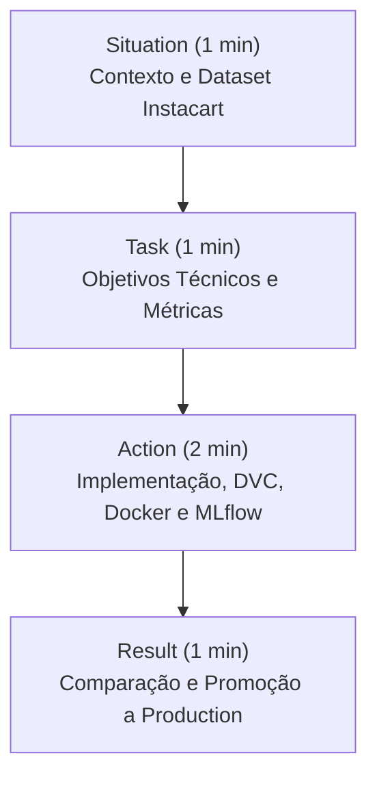

# Análise de Completude — Tech Challenge Fase 02

Esta análise cruza as informações do arquivo [checklist.md](file:///Users/eduardobatista/Code/ecommerce-recommendation-system/docs/checklist.md) com o código-fonte atual na branch `prod8910` e com as diretrizes e critérios de avaliação definidos no PDF oficial da FIAP ([Tech Challenge Fase 02.pdf](file:///Users/eduardobatista/Code/ecommerce-recommendation-system/docs/Tech%20Challenge%20Fase%2002.pdf)).

---

## 📌 Resumo Executivo: O Real Status do Entregável

O projeto está em um estado **altamente avançado e muito próximo de estar 100% pronto para a entrega**. O pipeline de dados (DVC), os modelos (SVD e NeuMF), a containerização (Docker Compose) e o tracking com o Model Registry (MLflow) estão **totalmente implementados, otimizados e testados**.

No entanto, há **divergências significativas** entre o checklist local e a realidade do repositório, além de **entregáveis cruciais do PDF que ainda não foram criados**.

### 📊 Visão Geral dos Requisitos do PDF da FIAP

| Critério (PDF) | Peso | Status Real | O que falta? |
| :--- | :---: | :---: | :--- |
| **Clean code e estrutura** | 15% | **Ajustes pendentes** | Corrigir 62 avisos do `ruff` (linter) nos arquivos de teste. |
| **Reprodutibilidade** | 15% | **Concluído** ✅ | Lock file, `.env`, `validate_env.py` totalmente funcionais. |
| **Docker** | 15% | **Concluído** ✅ | Dockerfile multi-stage e Docker Compose funcionais. |
| **DVC + Pipeline** | 15% | **Concluído** ✅ | Pipeline DVC com 4 stages executando perfeitamente local. |
| **Rede neural (PyTorch)** | 15% | **Concluído** ✅ | Modelo NeuMF implementado, treinado por 20 épocas (NDCG@10 de 7.10%). |
| **MLflow + Registry** | 10% | **Concluído** ✅ | Tracking e registro automático de modelo em Production estão funcionais. |
| **Vídeo STAR (5 min)** | 10% | **Pendente** 🔲 | A equipe precisa gravar o vídeo de 5 minutos explicando o projeto. |
| **Bônus: deploy em nuvem** | 5% | **Pendente** 🔲 | Opcional (URL pública do container). |
| **Model Card** | *Requisito* | **Pendente** 🔲 | Criar o arquivo `docs/model_card.md` com arquitetura, performance, limitações e vieses (exigido na pág. 6 do PDF). |

---

## 🔍 Divergências Encontradas no `checklist.md`

Cruzando o [checklist.md](file:///Users/eduardobatista/Code/ecommerce-recommendation-system/docs/checklist.md) com os arquivos reais da branch `prod8910`, identificamos as seguintes inconsistências:

1. **Item 4.10 (Remote DVC) — Marcado como Pendente 🔲, mas está Concluído ✅**
   * *O que diz o checklist:* Aponta para um caminho local do Windows (`C:\...`).
   * *O que está no repositório:* O arquivo `.dvc/config` foi atualizado para apontar para o mock local `/tmp/dvc-remote-ecommerce` (ADR-008). O versionamento está 100% configurado para rodar localmente sem conflitos de caminhos absolutos do Windows.
   * *Ação:* Marcar como `✅`.

2. **Item 10.1 (Lint final) — Marcado como Concluído ✅, mas está Falhando ❌**
   * *O que diz o checklist:* "`ruff check` executado".
   * *O que está no repositório:* Ao rodar `.venv/bin/ruff check src tests`, o linter retorna **62 erros** (importações não utilizadas, espaçamentos extras e linhas que excedem 88 caracteres), concentrados no arquivo de teste `tests/test_neural_recommender.py`.
   * *Ação:* Rodar `ruff check --fix` e formatar os arquivos para garantir 100% de conformidade técnica antes de submeter o repositório (evitando perda de pontos na categoria "Clean code e estrutura").

3. **Itens Opcionais/Não Obrigatórios listados como Pendentes 🔲**
   * **Item 2.8 (Notebook de EDA)**: O checklist marca como pendente. Porém, **o PDF da FIAP não exige a entrega de um Jupyter Notebook**. O checklist cita que a análise exploratória foi implementada de forma limpa diretamente nas classes do pipeline (`instacart_loader.py`). Portanto, este notebook é **opcional**.
   * **Item 4.7 (CI básico via GitHub Actions)**: O checklist lista como pendente. **O PDF não exige CI/CD com GitHub Actions**. Este item é **opcional**.

---

## 🔲 Itens Pendentes Obrigatórios (O que falta implementar)

Para garantir nota máxima conforme o PDF dos avaliadores, os seguintes itens **precisam** ser executados antes do envio:

### 1. Criar o Model Card (`docs/model_card.md`) — *Crítico*
A página 6 do PDF exige explicitamente um Model Card contendo:
* **Arquitetura**: Descrição detalhada da fusão GMF + MLP do NeuMF em PyTorch.
* **Performance**: Comparação direta das métricas NDCG@10, MAP@10, Precision@10 e Recall@10 (NeuMF vs SVD vs Popularidade).
* **Limitações**: Restrição da recomendação ao catálogo k-core filtrado, ausência de tratamento de cold-start para novos usuários.
* **Vieses**: Tendência de repetição de recomendações de produtos extremamente populares (popularidade implícita) e viés demográfico/sazonal herdado do dataset Instacart.

### 2. Atualizar e Consolidar o README (`README.md`)
O arquivo [README.md](file:///Users/eduardobatista/Code/ecommerce-recommendation-system/README.md) atual está incompleto e desatualizado:
* **Métricas antigas**: Ainda descreve o baseline de popularidade com 3.8% de HR@10 como "resultados atuais", omitindo os resultados do modelo neural NeuMF (7.10% NDCG@10).
* **Aviso de implementação futura**: A linha 213 diz que o MLflow e tracking "serão implementados na Etapa 8", mas isso já está implementado na branch.
* **Instruções de MLflow/DVC**: Precisa detalhar o comando para rodar o script de registro de modelo (`python scripts/register_model.py`) e a transição automática para Production.
* **Ambiente com `uv`**: O projeto tem suporte ao gerenciador `uv` (`uv.lock`), mas o README foca apenas no `poetry`. É ideal incluir comandos rápidos para `uv run` como alternativa de setup rápido.

### 3. Gravar o Vídeo de 5 minutos (Método STAR)
O PDF atribui **10% da nota** ao vídeo STAR. Abaixo, propomos um roteiro estruturado para garantir que todos os pontos avaliados sejam cobertos nos 5 minutos.

---

## 🎬 Roteiro Sugerido para o Vídeo (Método STAR — Max 5 min)

O vídeo deve cobrir exatamente os quatro pilares do STAR:

### 1. **Situation (Situação — ~1 min)**
* **O Problema**: E-commerce precisa recomendar produtos relevantes baseado na navegação/compras passadas do usuário.
* **O Dataset**: Instacart Market Basket Analysis (dados reais de compras com mais de 3 milhões de pedidos e 13 milhões de interações úteis).
* **Ajuste de escopo**: Explicar brevemente que o projeto adaptou a proposta inicial (Amazon) para o Instacart porque o pipeline já estava mais maduro e testado com esse volume massivo, superando amplamente o requisito mínimo de 10 mil interações.

### 2. **Task (Tarefa — ~1 min)**
* **Objetivo**: Criar um sistema de recomendação personalizado baseado em embeddings e redes neurais profundas (NeuMF).
* **Métricas Principais**: Ranquear os top-10 produtos relevantes medindo NDCG@10 (headline metric) e cobrindo Precision, Recall e MAP.
* **Restrições**: Padrões rígidos de engenharia de software (Clean Code, SOLID, type hints, testes unitários) e reprodutibilidade total em qualquer ambiente.

### 3. **Action (Ação — ~2 min)**
* **Arquitetura (NeuMF)**: Explicar o modelo em PyTorch combinando o ramo de fatoração generalizada (GMF) e o ramo perceptron multicamadas (MLP).
* **Engenharia de Software (Clean Code)**: Mostrar a aplicação de type hints, docstrings Google-style e o **Strategy Pattern** na interface `BaseRecommender` para desacoplar algoritmos de recomendação do pipeline.
* **MLOps e Reprodutibilidade**:
  * **DVC**: Versionamento do dataset e orquestração do pipeline em 4 etapas (`preprocess -> feature_eng -> train -> evaluate`).
  * **Docker**: Containerização multi-stage visando otimização de imagem (reduzida a ~700MB em CPU) e Docker Compose integrando o pipeline e o servidor local do MLflow.
  * **MLflow Tracking & Registry**: Logging automático de hiperparâmetros, artefatos de checkpoints e promoção de modelo via código para Production.

### 4. **Result (Resultado — ~1 min)**
* **Performance**: O NeuMF final (7.10% NDCG@10) superou o baseline SVD (2.17%) em **mais de 3.2x**, mostrando a eficácia da abordagem de aprendizado profundo.
* **Testes**: Mostrar que a suite de 40 testes unitários garante 100% de estabilidade de código.
* **Conclusão**: O entregável cumpre rigorosamente todos os critérios de reprodutibilidade e qualidade técnica propostos pelos avaliadores.

---

## 📋 Plano de Ação Recomendado

Para deixar o repositório perfeitamente redondo para entrega, sugerimos a execução dos seguintes passos:

1. **Limpeza do Linter (Ruff)**:
   * Rodar o comando de correção automática: `.venv/bin/ruff check src tests --fix`
   * Formatar o código: `.venv/bin/ruff format src tests`
   * Verificar se o linter passa limpo.
2. **Criação do Model Card**:
   * Criar o arquivo `docs/model_card.md` consolidando a arquitetura do NeuMF, as métricas finais obtidas e as análises de vieses e limitações do dataset Instacart.
3. **Atualização do README**:
   * Remover avisos sobre "implementações futuras" nas etapas 8 e 9.
   * Substituir as métricas provisórias de baseline do README pelos resultados consolidados do NeuMF vs SVD.
   * Incluir guias para rodar o pipeline com `uv` e executar o script de registro.
4. **Atualização do `checklist.md`**:
   * Marcar o item 4.10 (DVC Remote) como concluído (`✅`).
   * Marcar os itens de documentação (Bloco 9) como concluídos após a criação do Model Card e atualização do README.
   * Opcionalmente, deixar observações sobre os itens não obrigatórios (como GitHub Actions e Notebook EDA) para justificar a não implementação aos avaliadores.
